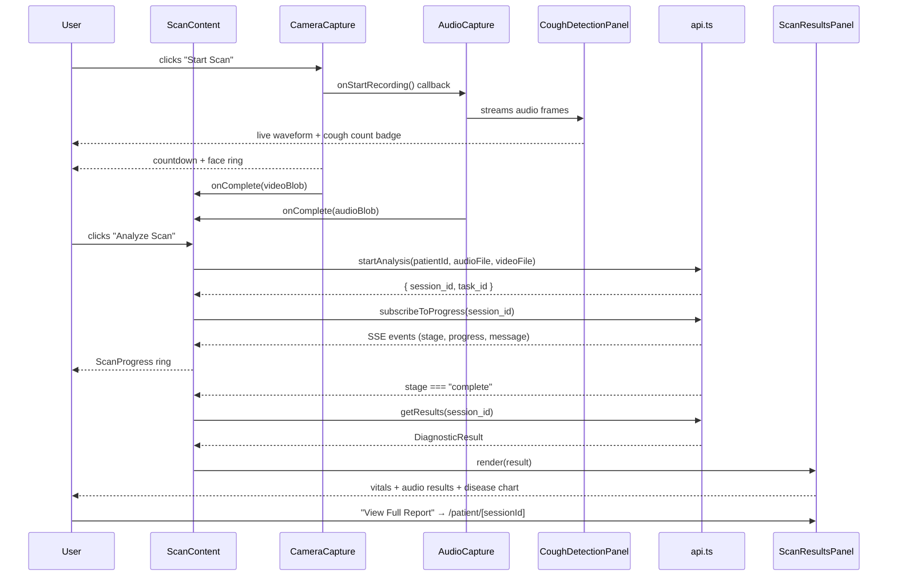
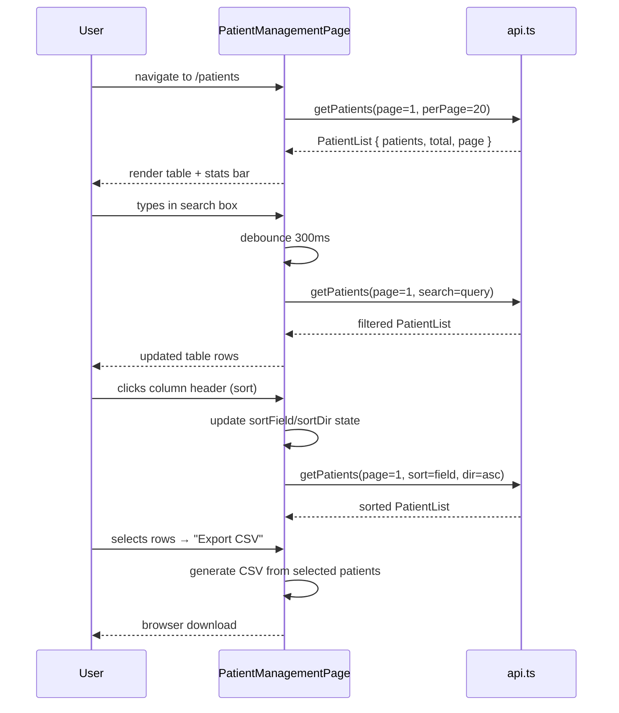
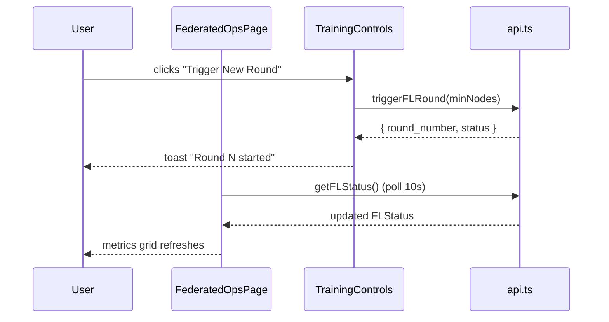

# Design Document: PRISM App Enhancements

## Overview

This document covers six interconnected enhancement areas for the PRISM clinical AI diagnostic platform frontend (Next.js 14 App Router). The changes transform three pages that currently duplicate dashboard content into fully differentiated, feature-rich views; add live cough-detection UX to the scan flow with inline results display; fix a TypeScript type error in the FL status API; and wire up several missing platform-wide features (offline banner, recent scans widget, live health checks, navigation fixes, and patient detail breadcrumbs).

The guiding principle is **differentiation without duplication**: each page must have a distinct purpose and data surface. The dashboard remains the at-a-glance overview; `/patients` becomes a full patient management console; `/federated` becomes the FL operations centre; `/scan` becomes a self-contained scan-to-results workflow.

---

## Architecture

```mermaid
graph TD
    subgraph Layout ["app/dashboard/layout.tsx (Sidebar)"]
        NAV["Nav: Dashboard · New Scan · Patients · Federated Learning"]
    end

    subgraph Pages
        DASH["app/dashboard/page.tsx\n(StatsOverview + RecentScans + SubsystemStatus)"]
        PAT["app/patients/page.tsx\n(PatientManagementPage — new)"]
        FED["app/federated/page.tsx\n(FederatedOpsPage — new)"]
        SCAN["app/scan/page.tsx\n(ScanContent — enhanced)"]
        DETAIL["app/patient/[id]/page.tsx\n(+ breadcrumb + demographics)"]
    end

    subgraph Components_Dashboard ["components/dashboard/"]
        SO["StatsOverview.tsx (fix flStatus type)"]
        PQ["PatientQueue.tsx (unchanged — dashboard widget)"]
        RS["RecentScans.tsx (new)"]
        SH["SubsystemHealth.tsx (new — live ping)"]
    end

    subgraph Components_Patients ["components/patients/"]
        PMT["PatientManagementTable.tsx (new)"]
        PSB["PatientStatsBar.tsx (new)"]
    end

    subgraph Components_Federated ["components/federated/"]
        FD["FederatedDashboard.tsx (unchanged — convergence chart)"]
        NPT["NodeParticipationTable.tsx (new)"]
        PBG["PrivacyBudgetGauge.tsx (new)"]
        RDT["RoundDetailTable.tsx (new)"]
        MVH["ModelVersionHistory.tsx (new)"]
        DPE["DPExplainerPanel.tsx (new)"]
        TC["TrainingControls.tsx (new)"]
    end

    subgraph Components_Scan ["components/scan/"]
        CC["CameraCapture.tsx (unchanged)"]
        AC["AudioCapture.tsx (enhanced — cough panel)"]
        SP["ScanProgress.tsx (unchanged)"]
        CD["CoughDetectionPanel.tsx (new)"]
        SR["ScanResultsPanel.tsx (new)"]
    end

    subgraph Lib ["lib/"]
        API["api.ts (add return types + getRecentSessions + healthCheck)"]
        TYPES["types.ts (add FLNode, ModelVersion, RecentSession)"]
    end

    Layout --> Pages
    DASH --> SO & PQ & RS & SH
    PAT --> PMT & PSB
    FED --> FD & NPT & PBG & RDT & MVH & DPE & TC
    SCAN --> CC & AC & CD & SR
    Pages --> Lib
    Components_Dashboard --> Lib
    Components_Patients --> Lib
    Components_Federated --> Lib
    Components_Scan --> Lib
```



---

## Sequence Diagrams

### Scan Flow (Enhanced)



### Patient Management Page Load



### FL Ops Page — Training Round Trigger



---

## Components and Interfaces

### 1. `components/dashboard/RecentScans.tsx` (new)

**Purpose**: Shows the last 5 diagnostic sessions with patient name, top diagnosis, confidence, and timestamp.

**Interface**:
```typescript
interface RecentSession {
  session_id: string;
  patient_id: string;
  patient_name?: string;
  primary_diagnosis?: string;
  confidence_score?: number;
  created_at: string;
}

interface RecentScansProps {
  limit?: number; // default 5
}
```

**Responsibilities**:
- Calls `getRecentSessions(limit)` on mount
- Renders a compact list with diagnosis badge and confidence bar
- Links each row to `/patient/[session_id]`

---

### 2. `components/dashboard/SubsystemHealth.tsx` (new)

**Purpose**: Replaces the hardcoded subsystem status panel with live health pings.

**Interface**:
```typescript
interface SubsystemStatus {
  name: string;
  description: string;
  endpoint: string;
  status: "online" | "degraded" | "offline" | "checking";
  latencyMs?: number;
}
```

**Responsibilities**:
- Pings `/health` endpoint on mount and every 30s
- Derives FL node status from `getFLStatus()`
- Shows latency badge alongside status dot

---

### 3. `components/patients/PatientStatsBar.tsx` (new)

**Purpose**: Summary row above the patient table showing aggregate metrics.

**Interface**:
```typescript
interface PatientStats {
  total: number;
  highRisk: number;
  scannedToday: number;
  avgSessions: number;
}

interface PatientStatsBarProps {
  stats: PatientStats;
  loading: boolean;
}
```

---

### 4. `components/patients/PatientManagementTable.tsx` (new)

**Purpose**: Full-featured patient table with search, filter, sort, pagination, bulk select, and CSV export.

**Interface**:
```typescript
interface PatientTableFilters {
  search: string;          // name or ABHA ID
  riskLevel: "all" | "high" | "medium" | "low";
  location: string;        // empty = all
}

interface PatientTableSort {
  field: "name" | "last_scan" | "sessions_count" | "created_at";
  direction: "asc" | "desc";
}

interface PatientManagementTableProps {
  onStatsChange: (stats: PatientStats) => void;
}
```

**Responsibilities**:
- Manages `filters`, `sort`, `page`, `selectedIds` state internally
- Derives `riskLevel` from `sessions_count`: ≥10 → High, ≥4 → Medium, else Low
- Bulk select with header checkbox; "Export CSV" button appears when selection > 0
- Quick Scan button per row → `/scan?patientId={id}`
- Pagination: prev/next + page number display

---

### 5. `components/federated/NodeParticipationTable.tsx` (new)

**Purpose**: Table of hospital nodes with participation stats.

**Interface**:
```typescript
interface FLNode {
  node_id: string;
  hospital_name: string;
  status: "active" | "idle" | "offline";
  rounds_participated: number;
  data_samples_contributed: number;
  dp_epsilon_spent: number;
  last_seen?: string;
}

interface NodeParticipationTableProps {
  nodes: FLNode[];
  loading: boolean;
}
```

---

### 6. `components/federated/PrivacyBudgetGauge.tsx` (new)

**Purpose**: Radial gauge showing cumulative ε vs budget limit (ε_max = 10).

**Interface**:
```typescript
interface PrivacyBudgetGaugeProps {
  currentEpsilon: number;
  maxEpsilon?: number;   // default 10
  delta?: number;        // default 1e-5
  noiseMultiplier?: number;
}
```

**Responsibilities**:
- SVG arc gauge: green (ε < 5), amber (5–8), red (> 8)
- Shows remaining budget as percentage
- Tooltip with δ and noise multiplier values

---

### 7. `components/federated/RoundDetailTable.tsx` (new)

**Purpose**: Expandable rows showing per-round participation and metric deltas.

**Interface**:
```typescript
interface RoundDetailTableProps {
  rounds: FLRound[];
  loading: boolean;
}
```

**Responsibilities**:
- Expandable row per round showing: nodes list, accuracy delta vs previous round, loss delta
- Color-coded delta badges (green = improvement)

---

### 8. `components/federated/ModelVersionHistory.tsx` (new)

**Purpose**: Table of past model versions.

**Interface**:
```typescript
interface ModelVersion {
  version: string;
  accuracy: number;
  loss: number;
  trained_at: string;
  participating_nodes: number;
}

interface ModelVersionHistoryProps {
  versions: ModelVersion[];
  loading: boolean;
}
```

---

### 9. `components/federated/DPExplainerPanel.tsx` (new)

**Purpose**: Explains current differential privacy parameters in plain language.

**Interface**:
```typescript
interface DPExplainerPanelProps {
  epsilon: number;
  delta: number;
  noiseMultiplier: number;
  mechanism: string; // e.g. "Gaussian"
}
```

---

### 10. `components/federated/TrainingControls.tsx` (new)

**Purpose**: Trigger new FL round and set minimum node threshold.

**Interface**:
```typescript
interface TrainingControlsProps {
  currentRound: number;
  totalNodes: number;
  onRoundTriggered: (roundNumber: number) => void;
}
```

**Responsibilities**:
- "Trigger New Round" button → calls `triggerFLRound(minNodes)`
- Min nodes slider (1 to totalNodes)
- Disabled while a round is in progress

---

### 11. `components/scan/CoughDetectionPanel.tsx` (new)

**Purpose**: Real-time cough event visualization on a scrolling time-axis waveform.

**Interface**:
```typescript
interface CoughEvent {
  timestamp: number;   // ms since recording start
  confidence: number;  // 0–1
}

interface CoughDetectionPanelProps {
  isRecording: boolean;
  audioAnalyser: AnalyserNode | null;  // passed from AudioCapture via ref/callback
}

// Internal state shape
interface CoughDetectionState {
  coughCount: number;
  events: CoughEvent[];
  currentLabel: "cough" | "breathing" | "silence";
  waveformBuffer: Float32Array;  // rolling 3s window
}
```

**Responsibilities**:
- Draws scrolling time-domain waveform (not frequency bars) on a canvas
- Detects cough events via energy threshold + zero-crossing rate heuristic
- Renders red vertical markers at cough timestamps on the waveform
- Increments cough count badge live
- Shows current sound type label

---

### 12. `components/scan/ScanResultsPanel.tsx` (new)

**Purpose**: Inline results display after analysis completes, before navigating to full report.

**Interface**:
```typescript
interface ScanResultsPanelProps {
  result: DiagnosticResult;
  sessionId: string;
  onScanAgain: () => void;
}
```

**Responsibilities**:
- rPPG vitals row: HR, SpO2, HRV (RMSSD), RR — each with color-coded status chip
- Audio results row: cough count, wheeze/crackle detected badges
- Visual results row: jaundice score, anemia score, cyanosis score as progress bars
- Top-5 disease probabilities as a horizontal mini bar chart (Recharts BarChart)
- "View Full Report" → `/patient/[sessionId]`
- "Scan Again" → calls `onScanAgain()`

---

## Data Models

### New types to add to `lib/types.ts`

```typescript
// Federated Learning — Node
export interface FLNode {
  node_id: string;
  hospital_name: string;
  status: "active" | "idle" | "offline";
  rounds_participated: number;
  data_samples_contributed: number;
  dp_epsilon_spent: number;
  last_seen?: string;
}

// Federated Learning — Model Version
export interface ModelVersion {
  version: string;
  accuracy: number;
  loss: number;
  trained_at: string;
  participating_nodes: number;
}

// Recent diagnostic session summary (for dashboard widget)
export interface RecentSession {
  session_id: string;
  patient_id: string;
  patient_name?: string;
  primary_diagnosis?: string;
  confidence_score?: number;
  created_at: string;
}

// Health check response
export interface HealthStatus {
  status: "ok" | "degraded" | "error";
  version?: string;
  uptime_seconds?: number;
}
```

### Updated `lib/api.ts` signatures

```typescript
// Fix return types (resolves TypeScript error in StatsOverview.tsx)
export async function getFLStatus(): Promise<FLStatus>
export async function getFLRounds(limit?: number): Promise<FLRound[] | { rounds: FLRound[] }>

// New endpoints
export async function getRecentSessions(limit?: number): Promise<RecentSession[]>
export async function healthCheck(): Promise<HealthStatus>
export async function getFLNodes(): Promise<FLNode[]>
export async function getModelVersionHistory(): Promise<ModelVersion[]>
export async function triggerFLRound(minNodes: number): Promise<{ round_number: number; status: string }>
export async function getPatients(
  page?: number,
  perPage?: number,
  search?: string,
  riskLevel?: string,
  sortField?: string,
  sortDir?: string
): Promise<PatientList>
```

---

## Algorithmic Pseudocode

### Patient Risk Level Derivation

```pascal
FUNCTION deriveRiskLevel(patient: Patient): "high" | "medium" | "low"
  INPUT: patient with sessions_count and last_session_date
  OUTPUT: risk level string

  BEGIN
    IF patient.sessions_count >= 10 THEN
      RETURN "high"
    ELSE IF patient.sessions_count >= 4 THEN
      RETURN "medium"
    ELSE
      RETURN "low"
    END IF
  END
END FUNCTION
```

**Preconditions**: `patient.sessions_count` is a non-negative integer  
**Postconditions**: Returns exactly one of "high" | "medium" | "low"

---

### Cough Detection Heuristic

```pascal
FUNCTION detectCoughEvent(
  timeDomainBuffer: Float32Array,
  sampleRate: number,
  threshold: number = 0.15
): boolean
  INPUT: 256-sample time-domain audio buffer, sample rate, energy threshold
  OUTPUT: boolean — true if cough event detected

  BEGIN
    // Step 1: Compute RMS energy
    sumSquares ← 0
    FOR i FROM 0 TO buffer.length - 1 DO
      sumSquares ← sumSquares + (buffer[i] * buffer[i])
    END FOR
    rms ← sqrt(sumSquares / buffer.length)

    // Step 2: Compute zero-crossing rate
    zeroCrossings ← 0
    FOR i FROM 1 TO buffer.length - 1 DO
      IF sign(buffer[i]) ≠ sign(buffer[i-1]) THEN
        zeroCrossings ← zeroCrossings + 1
      END IF
    END FOR
    zcr ← zeroCrossings / buffer.length

    // Step 3: Classify
    // Cough: high energy burst + moderate ZCR (not pure noise)
    IF rms > threshold AND zcr > 0.1 AND zcr < 0.45 THEN
      RETURN true
    ELSE
      RETURN false
    END IF
  END
END FUNCTION
```

**Preconditions**: `timeDomainBuffer` is a valid Float32Array of length ≥ 2  
**Postconditions**: Returns boolean; no side effects on buffer  
**Loop Invariants**: `sumSquares` accumulates only valid squared samples; `zeroCrossings` counts only valid sign changes

---

### CSV Export

```pascal
PROCEDURE exportPatientsCSV(patients: Patient[]): void
  INPUT: array of selected Patient objects
  OUTPUT: browser file download (side effect)

  BEGIN
    headers ← ["ID", "Name", "Age", "Sex", "Location", "ABHA ID",
                "Sessions", "Last Scan", "Risk Level"]
    rows ← [headers]

    FOR each patient IN patients DO
      risk ← deriveRiskLevel(patient)
      row ← [
        patient.id,
        patient.demographics?.name ?? "—",
        patient.demographics?.age ?? "—",
        patient.demographics?.sex ?? "—",
        patient.demographics?.location ?? "—",
        patient.abha_id ?? "—",
        patient.sessions_count,
        patient.last_session_date ?? "Never",
        risk
      ]
      rows.append(row)
    END FOR

    csvContent ← rows.map(r → r.join(",")).join("\n")
    blob ← new Blob([csvContent], { type: "text/csv" })
    url ← URL.createObjectURL(blob)
    triggerDownload(url, "patients_export.csv")
    URL.revokeObjectURL(url)
  END
END PROCEDURE
```

**Preconditions**: `patients` is a non-empty array  
**Postconditions**: Browser download is triggered; no mutations to input array

---

### Privacy Budget Gauge Arc Calculation

```pascal
FUNCTION computeGaugeArc(
  epsilon: number,
  maxEpsilon: number,
  radius: number,
  startAngle: number = -135°,
  endAngle: number = 135°
): { d: string; color: string }
  INPUT: current epsilon, max epsilon, SVG radius, arc start/end angles
  OUTPUT: SVG path string and color

  BEGIN
    fraction ← clamp(epsilon / maxEpsilon, 0, 1)
    sweepAngle ← (endAngle - startAngle) * fraction
    arcEndAngle ← startAngle + sweepAngle

    x1 ← cx + radius * cos(startAngle)
    y1 ← cy + radius * sin(startAngle)
    x2 ← cx + radius * cos(arcEndAngle)
    y2 ← cy + radius * sin(arcEndAngle)

    largeArcFlag ← IF sweepAngle > 180° THEN 1 ELSE 0

    d ← "M x1 y1 A radius radius 0 largeArcFlag 1 x2 y2"

    IF epsilon < 5 THEN
      color ← "#22c55e"   // green
    ELSE IF epsilon < 8 THEN
      color ← "#f59e0b"   // amber
    ELSE
      color ← "#ef4444"   // red
    END IF

    RETURN { d, color }
  END
END FUNCTION
```

**Preconditions**: `maxEpsilon > 0`, `radius > 0`  
**Postconditions**: Returns valid SVG path string and a valid CSS color

---

## Key Functions with Formal Specifications

### `getPatients` (extended signature)

```typescript
export async function getPatients(
  page = 1,
  perPage = 20,
  search = "",
  riskLevel = "all",
  sortField = "created_at",
  sortDir = "desc"
): Promise<PatientList>
```

**Preconditions**:
- `page >= 1`
- `perPage` is in range [1, 100]
- `sortField` is one of `"name" | "last_scan" | "sessions_count" | "created_at"`
- `sortDir` is `"asc"` or `"desc"`

**Postconditions**:
- Returns `PatientList` with `patients.length <= perPage`
- `total` reflects the unfiltered count matching the search/filter
- If `search` is non-empty, all returned patients match by name or ABHA ID

---

### `getFLStatus` (fixed return type)

```typescript
export async function getFLStatus(): Promise<FLStatus>
```

**Preconditions**: Backend FL server is reachable  
**Postconditions**:
- Returns `FLStatus` with all required fields populated
- `cumulative_dp_epsilon >= 0`
- `active_nodes <= total_nodes`

---

### `ScanResultsPanel` — vitals status color

```typescript
function getVitalStatus(
  metric: "hr" | "spo2" | "hrv" | "rr",
  value: number
): "normal" | "warning" | "critical"
```

**Preconditions**: `value` is a finite number  
**Postconditions**: Returns one of three status strings based on clinical thresholds:

| Metric | Normal | Warning | Critical |
|--------|--------|---------|----------|
| HR (bpm) | 60–100 | 50–59 or 101–120 | < 50 or > 120 |
| SpO2 (%) | ≥ 95 | 90–94 | < 90 |
| HRV RMSSD (ms) | 20–80 | 10–19 or 81–120 | < 10 or > 120 |
| RR (breaths/min) | 12–20 | 8–11 or 21–25 | < 8 or > 25 |

---

## Error Handling

### API Failures on Patient Management Page

**Condition**: `getPatients()` throws `ApiError`  
**Response**: Show inline error banner with retry button; table shows empty state  
**Recovery**: Retry button re-calls `getPatients()` with same filters

### FL Ops Page — Trigger Round Failure

**Condition**: `triggerFLRound()` returns non-2xx  
**Response**: Toast notification "Failed to trigger round — check node availability"  
**Recovery**: Button re-enables after 3s; user can retry

### Scan Results — `getResults()` Failure

**Condition**: SSE reports `stage === "complete"` but `getResults()` throws  
**Response**: Show error state in `ScanResultsPanel` with "View Full Report" button still enabled (links to `/patient/[sessionId]` which has its own error handling)  
**Recovery**: User can navigate to full report page which retries independently

### Cough Detection — Microphone Permission Denied

**Condition**: `getUserMedia({ audio: true })` throws `NotAllowedError`  
**Response**: `CoughDetectionPanel` shows "Microphone access required for cough detection" with a permissions guide link  
**Recovery**: User grants permission and clicks "Retry"

---

## Testing Strategy

### Unit Testing Approach

Test pure utility functions and state derivation logic in isolation:
- `deriveRiskLevel(patient)` — boundary values at sessions_count 3/4 and 9/10
- `getVitalStatus(metric, value)` — boundary values at each clinical threshold
- `computeGaugeArc(epsilon, maxEpsilon, ...)` — epsilon at 0, 5, 8, 10
- `detectCoughEvent(buffer, sampleRate)` — synthetic buffers with known RMS/ZCR values
- CSV export — verify header row and data row formatting

### Property-Based Testing Approach

**Property Test Library**: fast-check

**Properties to verify**:

1. **Risk level completeness**: For any non-negative integer `sessions_count`, `deriveRiskLevel` always returns one of exactly `["high", "medium", "low"]`.

   ```typescript
   fc.property(fc.nat(), (n) => {
     const level = deriveRiskLevel({ sessions_count: n } as Patient);
     return ["high", "medium", "low"].includes(level);
   })
   ```

2. **Vital status completeness**: For any finite number and any valid metric key, `getVitalStatus` always returns one of `["normal", "warning", "critical"]`.

3. **Gauge arc fraction clamping**: For any `epsilon >= 0` and `maxEpsilon > 0`, the computed arc fraction is always in `[0, 1]`.

4. **CSV row count**: For any array of N patients, the exported CSV always has exactly N + 1 rows (header + data).

5. **Pagination invariant**: For any `page >= 1` and `perPage >= 1`, `patients.length <= perPage` always holds in the returned `PatientList`.

### Integration Testing Approach

- Render `PatientManagementTable` with MSW-mocked `getPatients` responses; verify search debounce, sort header clicks, and pagination controls update the API call parameters correctly.
- Render `FederatedOpsPage` with mocked FL endpoints; verify `PrivacyBudgetGauge` color changes at ε = 5 and ε = 8.
- Render `ScanContent` through the full capture → processing → results flow using mocked SSE and `getResults`.

---

## Performance Considerations

- **Patient table search**: Debounce input by 300ms before firing API call to avoid request storms.
- **FL page polling**: `getFLStatus()` polls every 10s (existing); `getFLNodes()` polls every 30s (slower — node status changes infrequently).
- **Cough detection canvas**: Use `requestAnimationFrame` for waveform drawing; cancel frame on unmount to prevent memory leaks.
- **Recent scans widget**: Cache result in component state; only refetch on manual refresh or page focus.
- **SubsystemHealth pings**: Stagger health check intervals (backend at 0s, FL at 5s, ABDM at 10s) to avoid simultaneous requests on page load.

---

## Security Considerations

- **CSV export**: All data is already loaded client-side from authenticated API calls; no additional auth needed for export. Sanitize patient name fields to prevent CSV injection (strip leading `=`, `+`, `-`, `@` characters).
- **FL round trigger**: The `triggerFLRound` API call must include the `Authorization: Bearer` header (already handled by the `request()` helper in `api.ts`). The button should be disabled for read-only roles (future RBAC consideration).
- **Cough detection**: Audio processing is entirely client-side; no audio data is sent to any third-party service. The audio blob is only uploaded to the PRISM backend via `startAnalysis`.

---

## Dependencies

All dependencies are already present in the project:
- **Recharts** — used for the mini disease probability bar chart in `ScanResultsPanel` and the convergence chart in `FederatedDashboard`
- **framer-motion** — used in `ScanProgress`; available for panel animations
- **Next.js 14 App Router** — `useRouter`, `useSearchParams`, `usePathname`
- **Tailwind CSS** — all styling

No new npm packages are required.

---

## Correctness Properties

These properties are derived from the prework analysis and are suitable for property-based testing with **fast-check**.

### P1 — Risk Level Completeness

For any non-negative integer `sessions_count`, `deriveRiskLevel` always returns exactly one of `["high", "medium", "low"]`.

```typescript
// ∀ n ∈ ℕ₀ : deriveRiskLevel({ sessions_count: n }) ∈ { "high", "medium", "low" }
fc.assert(
  fc.property(fc.nat(), (n) => {
    const level = deriveRiskLevel({ sessions_count: n } as Patient);
    return ["high", "medium", "low"].includes(level);
  })
);
```

### P2 — Risk Level Monotonicity

Risk level is monotonically non-decreasing with `sessions_count`: if `a >= b` then `riskRank(a) >= riskRank(b)`.

```typescript
// ∀ a, b ∈ ℕ₀ : a ≥ b ⟹ riskRank(a) ≥ riskRank(b)
const RANK = { low: 0, medium: 1, high: 2 };
fc.assert(
  fc.property(fc.nat(), fc.nat(), (a, b) => {
    const ra = RANK[deriveRiskLevel({ sessions_count: a } as Patient)];
    const rb = RANK[deriveRiskLevel({ sessions_count: b } as Patient)];
    return a >= b ? ra >= rb : true;
  })
);
```

### P3 — Vital Status Completeness

For any finite number and any valid metric key, `getVitalStatus` always returns one of `["normal", "warning", "critical"]`.

```typescript
// ∀ metric ∈ MetricKeys, ∀ v ∈ ℝ : getVitalStatus(metric, v) ∈ { "normal", "warning", "critical" }
fc.assert(
  fc.property(
    fc.constantFrom("hr", "spo2", "hrv", "rr"),
    fc.float({ noNaN: true, noDefaultInfinity: true }),
    (metric, value) => {
      const status = getVitalStatus(metric as VitalMetric, value);
      return ["normal", "warning", "critical"].includes(status);
    }
  )
);
```

### P4 — Privacy Budget Gauge Fraction Clamping

For any `epsilon >= 0` and `maxEpsilon > 0`, the computed arc fraction is always in `[0, 1]`.

```typescript
// ∀ ε ≥ 0, ∀ εmax > 0 : fraction(ε, εmax) ∈ [0, 1]
fc.assert(
  fc.property(
    fc.float({ min: 0, noNaN: true, noDefaultInfinity: true }),
    fc.float({ min: 0.001, noNaN: true, noDefaultInfinity: true }),
    (epsilon, maxEpsilon) => {
      const fraction = Math.min(epsilon / maxEpsilon, 1);
      return fraction >= 0 && fraction <= 1;
    }
  )
);
```

### P5 — CSV Export Row Count

For any non-empty array of N patients, the exported CSV always has exactly N + 1 rows (1 header + N data rows).

```typescript
// ∀ patients : |patients| = N ⟹ csvRowCount(patients) = N + 1
fc.assert(
  fc.property(fc.array(arbitraryPatient, { minLength: 1, maxLength: 50 }), (patients) => {
    const csv = generatePatientCSV(patients);
    const rows = csv.trim().split("\n");
    return rows.length === patients.length + 1;
  })
);
```

### P6 — Cough Detection Determinism

For the same audio buffer, `detectCoughEvent` always returns the same result (pure function, no side effects).

```typescript
// ∀ buffer : detectCoughEvent(buffer) = detectCoughEvent(buffer)
fc.assert(
  fc.property(fc.float32Array({ minLength: 256, maxLength: 256 }), (buffer) => {
    const r1 = detectCoughEvent(buffer, 44100);
    const r2 = detectCoughEvent(buffer, 44100);
    return r1 === r2;
  })
);
```

### P7 — Pagination Row Count Invariant

For any valid `page` and `perPage`, the rendered patient row count never exceeds `perPage`.

```typescript
// ∀ page ≥ 1, ∀ perPage ≥ 1 : renderedRows ≤ perPage
fc.assert(
  fc.property(
    fc.integer({ min: 1, max: 100 }),
    fc.integer({ min: 1, max: 100 }),
    async (page, perPage) => {
      const result = await getPatients(page, perPage);
      return result.patients.length <= perPage;
    }
  )
);
```
