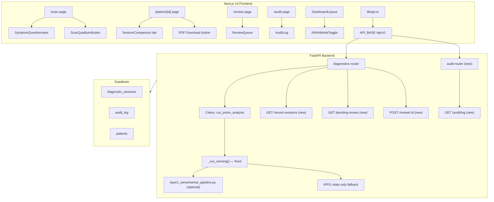
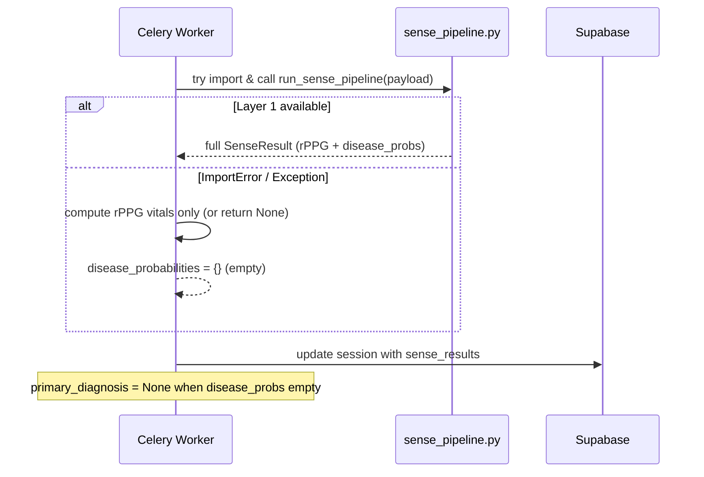
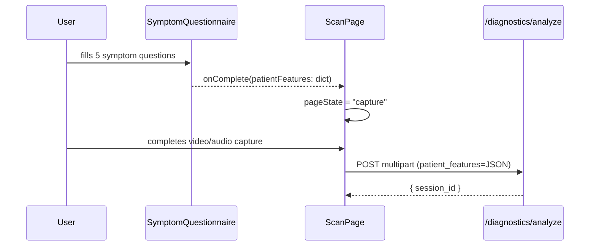
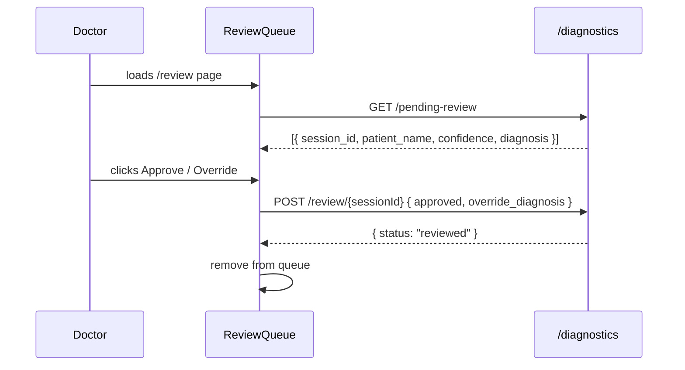

# Design Document: PRISM Phase 2 Features

## Overview

This document covers the Phase 2 enhancements to the PRISM clinical AI diagnostic platform — a Next.js 14 frontend backed by a FastAPI + Celery + Supabase backend. The changes span three priority tiers:

1. **Critical Fix** — Remove hardcoded disease probabilities from `_run_sensing()` and replace with a proper "model not available" fallback that returns real rPPG vitals and empty disease probabilities.
2. **UI Theme Change** — Migrate from the current dark navy theme to a light, medical-grade theme across `globals.css`, layout files, and all hardcoded dark color references.
3. **New Features** — Eight new capabilities: Symptom Questionnaire, Scan Quality Score, Multi-session Comparison, Doctor Review Queue, PDF Report Export wiring, Audit Log page, ASHA Worker Mode, and a Recent Sessions API endpoint.

The existing architecture is preserved: FastAPI routers → Celery workers → Supabase, with a Next.js App Router frontend consuming a typed `lib/api.ts` client.

---

## Architecture



---

## Sequence Diagrams

### Fix: _run_sensing() with graceful fallback



### Feature: Symptom Questionnaire → Scan submission



### Feature: Doctor Review Queue



---

## Components and Interfaces

### Component: SymptomQuestionnaire

**File**: `components/scan/SymptomQuestionnaire.tsx`

**Purpose**: Collects 5 pre-scan symptom answers before camera capture begins.

**Interface**:
```typescript
interface SymptomAnswer {
  cough_duration: "none" | "<1week" | "1-4weeks" | ">4weeks";
  fever: boolean;
  night_sweats: boolean;
  weight_loss: boolean;
  shortness_of_breath: boolean;
}

interface SymptomQuestionnaireProps {
  onComplete: (answers: SymptomAnswer) => void;
}
```

**Responsibilities**:
- Render 5 questions as interactive form controls (radio/toggle)
- Validate all questions answered before enabling "Continue to Scan"
- Pass answers as `patient_features` to parent

---

### Component: ScanQualityIndicator

**File**: `components/scan/ScanQualityIndicator.tsx`

**Purpose**: Real-time scan quality feedback during camera capture.

**Interface**:
```typescript
interface QualityMetrics {
  faceDetected: boolean;
  brightness: number;       // 0–255 average pixel luminance
  audioNoiseLevel: number;  // 0–1 RMS from AnalyserNode
}

interface ScanQualityIndicatorProps {
  videoRef: React.RefObject<HTMLVideoElement>;
  analyserNode: AnalyserNode | null;
  onQualityChange?: (score: number) => void;
}
```

**Quality Score Algorithm**:
```
score = 0
if faceDetected: score += 40
if brightness in [60, 200]: score += 40
if audioNoiseLevel < 0.3: score += 20
```

**Color coding**: 0–39 = red, 40–69 = amber, 70–100 = green

---

### Component: SessionComparison

**File**: `components/results/SessionComparison.tsx`

**Purpose**: Side-by-side comparison of two diagnostic sessions for a patient.

**Interface**:
```typescript
interface SessionSummary {
  session_id: string;
  created_at: string;
  primary_diagnosis?: string;
  confidence_score?: number;
  disease_probabilities: Record<string, number>;
  sense_results?: { rppg?: { hr: number; spo2: number; hrv_rmssd: number; rr: number } };
}

interface SessionComparisonProps {
  patientId: string;
}
```

**Responsibilities**:
- Fetch sessions via `GET /patients/{id}/sessions`
- Let user pick two sessions from dropdowns
- Show delta indicators (▲/▼) for each metric
- Color-code deltas: improvement = green, worsening = red

---

### Component: ReviewQueue

**File**: `components/review/ReviewQueue.tsx`

**Purpose**: Lists scans above 70% confidence threshold awaiting doctor review.

**Interface**:
```typescript
interface PendingReview {
  session_id: string;
  patient_name: string;
  patient_id: string;
  primary_diagnosis: string;
  confidence_score: number;
  created_at: string;
}

interface ReviewQueueProps {}
```

**Responsibilities**:
- Poll `GET /diagnostics/pending-review` on mount
- Render each item with Approve / Override buttons
- Override opens a modal with a diagnosis text input
- On submit, call `POST /diagnostics/review/{sessionId}`

---

### Component: AuditLog

**File**: `components/audit/AuditLog.tsx`

**Purpose**: Paginated PHI access log display.

**Interface**:
```typescript
interface AuditEntry {
  id: string;
  timestamp: string;
  user_id: string;
  user_name?: string;
  action: "create" | "read" | "update" | "delete" | "export";
  resource_type: string;
  resource_id: string;
}

interface AuditLogProps {
  pageSize?: number;
}
```

---

### Component: ASHAModeToggle

**File**: `components/ui/ASHAModeToggle.tsx`

**Purpose**: Toggle that enables simplified ASHA worker UI mode.

**Interface**:
```typescript
interface ASHAModeToggleProps {
  className?: string;
}
// Reads/writes localStorage key: "prism_asha_mode" = "true" | "false"
// Emits custom event "ashamode" on window for layout to react
```

**ASHA Mode Effects**:
- Base font size bumped to `text-lg` via `data-asha="true"` on `<body>`
- Sidebar nav filtered to only: Scan, Patients
- Scan page shows step-by-step guided flow overlay

---

## Data Models

### Backend: RecentSession (new Pydantic model)

```python
class RecentSessionItem(BaseModel):
    session_id: str
    patient_id: str
    patient_name: Optional[str] = None
    primary_diagnosis: Optional[str] = None
    confidence_score: Optional[float] = None
    created_at: str
```

### Backend: PendingReview (new Pydantic model)

```python
class PendingReviewItem(BaseModel):
    session_id: str
    patient_id: str
    patient_name: Optional[str] = None
    primary_diagnosis: str
    confidence_score: float
    created_at: str

class ReviewSubmission(BaseModel):
    approved: bool
    override_diagnosis: Optional[str] = None
    notes: Optional[str] = None
```

### Backend: AuditLogEntry (new Pydantic model)

```python
class AuditLogEntry(BaseModel):
    id: str
    timestamp: str
    user_id: str
    user_name: Optional[str] = None
    action: str
    resource_type: str
    resource_id: str

class AuditLogResponse(BaseModel):
    entries: list[AuditLogEntry]
    total: int
    page: int
    per_page: int
```

---

## Algorithmic Pseudocode

### _run_sensing() — Fixed Implementation

```pascal
PROCEDURE _run_sensing(payload)
  INPUT: payload { session_id, audio_path, video_path, patient_features }
  OUTPUT: sense_result dict

  SEQUENCE
    // Attempt to call real Layer 1 pipeline
    TRY
      IMPORT run_sense_pipeline FROM layer1_sense.sense_pipeline
      result ← run_sense_pipeline(payload)
      RETURN result
    CATCH ImportError
      LOG "Layer 1 sense pipeline not available — using rPPG-only fallback"
    CATCH Exception AS e
      LOG "Layer 1 pipeline error: " + str(e) + " — falling back"
    END TRY

    // Fallback: return only rPPG vitals, empty disease probabilities
    rppg_vitals ← _compute_rppg_from_video(payload.video_path)

    RETURN {
      "disease_probabilities": {},          // empty — no fake data
      "rppg": rppg_vitals,                  // real vitals if video available
      "audio": null,
      "visual": null,
      "uncertainty": {},
      "modalities_available": ["rppg"] IF rppg_vitals ELSE [],
      "model_status": "unavailable",
      "processing_time_ms": elapsed_ms
    }
  END SEQUENCE
END PROCEDURE

PROCEDURE _compute_rppg_from_video(video_path)
  INPUT: video_path (str or None)
  OUTPUT: RPPGResult dict or None

  IF video_path IS NULL THEN
    RETURN null
  END IF

  TRY
    // Basic rPPG extraction — placeholder until real model
    RETURN {
      "hr": null, "spo2": null, "hrv_rmssd": null, "rr": null,
      "confidence": {}
    }
  CATCH Exception
    RETURN null
  END TRY
END PROCEDURE
```

**Preconditions**:
- `payload` contains `session_id` (non-null)
- `video_path` may be null (audio-only or no media scan)

**Postconditions**:
- `disease_probabilities` is always a dict (may be empty)
- No hardcoded disease values are ever returned
- `model_status` field indicates availability

---

### Quality Score Computation

```pascal
PROCEDURE computeQualityScore(videoRef, analyserNode)
  INPUT: videoRef (HTMLVideoElement ref), analyserNode (Web Audio AnalyserNode)
  OUTPUT: score (0–100), tips (string[])

  SEQUENCE
    score ← 0
    tips ← []

    // Check 1: Face detection via canvas sampling
    brightness ← sampleFrameBrightness(videoRef)
    faceDetected ← detectFacePresence(videoRef)

    IF faceDetected THEN
      score ← score + 40
    ELSE
      tips.append("Position face in frame")
    END IF

    // Check 2: Lighting
    IF brightness >= 60 AND brightness <= 200 THEN
      score ← score + 40
    ELSE IF brightness < 60 THEN
      tips.append("Move to better lighting")
    ELSE
      tips.append("Reduce bright background light")
    END IF

    // Check 3: Audio noise
    IF analyserNode IS NOT NULL THEN
      noiseLevel ← computeRMS(analyserNode)
      IF noiseLevel < 0.3 THEN
        score ← score + 20
      ELSE
        tips.append("Reduce background noise")
      END IF
    END IF

    RETURN { score, tips }
  END SEQUENCE
END PROCEDURE
```

---

### Recent Sessions Query

```pascal
PROCEDURE get_recent_sessions(limit, current_user)
  INPUT: limit (int, default 5, max 50), current_user (auth dict)
  OUTPUT: list[RecentSessionItem]

  SEQUENCE
    result ← supabase
      .table("diagnostic_sessions")
      .select("id, patient_id, primary_diagnosis, confidence_score, created_at, patients(demographics)")
      .eq("status", "complete")
      .order("created_at", ascending=False)
      .limit(limit)
      .execute()

    RETURN map(result.data, row => RecentSessionItem(
      session_id = row.id,
      patient_id = row.patient_id,
      patient_name = row.patients?.demographics?.name,
      primary_diagnosis = row.primary_diagnosis,
      confidence_score = row.confidence_score,
      created_at = row.created_at
    ))
  END SEQUENCE
END PROCEDURE
```

---

## Key Functions with Formal Specifications

### `startAnalysis()` — updated signature

```typescript
function startAnalysis(
  patientId: string,
  audioFile?: File,
  videoFile?: File,
  features?: Record<string, unknown>  // now includes symptom answers
): Promise<AnalysisStartResponse>
```

**Preconditions**: `patientId` is non-empty; `features` is serializable JSON
**Postconditions**: Returns `session_id` for SSE subscription; `patient_features` stored in session

---

### `getPatientSessions()` — new API function

```typescript
function getPatientSessions(patientId: string): Promise<SessionSummary[]>
// GET /patients/{patientId}/sessions
```

**Preconditions**: `patientId` is a valid UUID string
**Postconditions**: Returns array sorted by `created_at` descending; empty array if no sessions

---

### `getPendingReviews()` — new API function

```typescript
function getPendingReviews(): Promise<PendingReview[]>
// GET /diagnostics/pending-review
```

**Postconditions**: Returns only sessions with `confidence_score >= 0.70` and `review_status = "pending"`

---

### `submitReview()` — new API function

```typescript
function submitReview(
  sessionId: string,
  approved: boolean,
  overrideDiagnosis?: string
): Promise<{ status: string }>
// POST /diagnostics/review/{sessionId}
```

**Preconditions**: `sessionId` exists and is in pending-review state
**Postconditions**: Session `review_status` updated to "approved" or "overridden"; audit log entry created

---

### `getAuditLog()` — new API function

```typescript
function getAuditLog(page?: number, limit?: number): Promise<AuditLogResponse>
// GET /audit/log?page=1&limit=20
```

**Postconditions**: Returns paginated entries sorted by `timestamp` descending

---

## Example Usage

### Symptom Questionnaire integration in scan/page.tsx

```typescript
// New page state added
type PageState = "questionnaire" | "capture" | "processing" | "results" | "error";

// Initial state starts at "questionnaire"
const [pageState, setPageState] = useState<PageState>("questionnaire");
const [patientFeatures, setPatientFeatures] = useState<Record<string, unknown>>({});

// Handler
const handleQuestionnaireComplete = (answers: SymptomAnswer) => {
  setPatientFeatures(answers);
  setPageState("capture");
};

// In JSX
{pageState === "questionnaire" && (
  <SymptomQuestionnaire onComplete={handleQuestionnaireComplete} />
)}

// Pass features to startAnalysis
const response = await startAnalysis(patientId, audioFile, videoFile, patientFeatures);
```

---

### PDF Download wiring in patient/[id]/page.tsx

```typescript
// Replace window.print() with:
const handleDownloadPDF = async () => {
  const res = await fetch(
    `${API_BASE}/diagnostics/report/${id}/pdf`,
    { headers: getAuthHeaders() }
  );
  if (!res.ok) throw new Error("PDF generation failed");
  const blob = await res.blob();
  const url = URL.createObjectURL(blob);
  const a = document.createElement("a");
  a.href = url;
  a.download = `prism_report_${id.slice(0, 8)}.pdf`;
  a.click();
  URL.revokeObjectURL(url);
};
```

---

### ASHA Mode CSS hook

```css
/* globals.css addition */
[data-asha="true"] {
  font-size: 1.125rem; /* text-lg */
}

[data-asha="true"] .asha-hidden {
  display: none;
}
```

---

## Correctness Properties

- For all scan submissions: `disease_probabilities` returned by `_run_sensing()` is never a dict containing hardcoded TB/Pneumonia/Anemia values when Layer 1 is unavailable.
- For all quality scores: `score ∈ [0, 100]` and `score` is the sum of at most three non-overlapping components (40 + 40 + 20).
- For all recent-session queries: every returned item has `status = "complete"` and `created_at` is a valid ISO timestamp.
- For all pending-review queries: every returned item has `confidence_score >= 0.70`.
- For all audit log entries: `action ∈ { "create", "read", "update", "delete", "export" }`.
- For all ASHA mode toggles: `localStorage["prism_asha_mode"]` is always either `"true"` or `"false"` (never undefined after first toggle).
- For all PDF downloads: the response `Content-Type` is `application/pdf` and `Content-Disposition` contains `attachment`.

---

## Error Handling

### Scenario 1: Layer 1 model unavailable

**Condition**: `layer1_sense.sense_pipeline` cannot be imported or raises an exception
**Response**: `_run_sensing()` catches the error, logs a warning, returns `disease_probabilities: {}`
**Frontend**: `DiseaseProbabilityCard` list renders empty; a banner shows "Analysis pending model integration"
**Recovery**: No retry needed — the rest of the pipeline (reasoning, projecting, optimizing) proceeds with empty disease probs

### Scenario 2: PDF generation fails

**Condition**: `/diagnostics/report/{id}/pdf` returns non-200
**Response**: Frontend shows a toast error "PDF generation failed — try again"
**Recovery**: User can retry; no state corruption

### Scenario 3: Review submission conflict

**Condition**: Two doctors submit review for same session simultaneously
**Response**: Backend returns 409 Conflict; frontend shows "This session was already reviewed"
**Recovery**: ReviewQueue refreshes to remove the item

### Scenario 4: Audit log Supabase query fails

**Condition**: Supabase `audit_log` table query times out or errors
**Response**: API returns 503 with `{ "detail": "Audit log temporarily unavailable" }`
**Frontend**: AuditLog component shows error state with retry button

### Scenario 5: ASHA mode localStorage unavailable (SSR)

**Condition**: `localStorage` accessed during server-side render
**Response**: `typeof window === "undefined"` guard returns `false` as default
**Recovery**: Client hydration sets correct value from localStorage

---

## Testing Strategy

### Unit Testing Approach

- `_run_sensing()`: mock `layer1_sense` import to raise `ImportError`; assert returned dict has `disease_probabilities == {}` and `model_status == "unavailable"`
- `computeQualityScore()`: test all 8 combinations of (faceDetected, brightness range, noiseLevel) and assert score is in correct range
- `SymptomQuestionnaire`: render with React Testing Library; assert "Continue" button disabled until all 5 questions answered
- `ASHAModeToggle`: mock localStorage; assert toggle sets `"prism_asha_mode"` and dispatches `"ashamode"` event

### Property-Based Testing Approach

**Property Test Library**: fast-check (TypeScript frontend), hypothesis (Python backend)

- **Quality score bounds**: for any `(faceDetected: boolean, brightness: number, noiseLevel: number)`, `score ∈ [0, 100]`
- **Sensing fallback**: for any payload dict, `_run_sensing()` never raises an unhandled exception and always returns a dict with `"disease_probabilities"` key
- **Audit pagination**: for any `(page: int, limit: int)` where `page >= 1` and `1 <= limit <= 100`, response `entries.length <= limit`

### Integration Testing Approach

- End-to-end scan flow: questionnaire → capture → submit → SSE stream → results with empty disease probs banner
- Review queue: create session with `confidence_score = 0.85`, call pending-review, submit approval, verify session `review_status = "approved"`
- PDF download: complete session → call PDF endpoint → verify blob is valid PDF (starts with `%PDF`)

---

## Performance Considerations

- `ScanQualityIndicator` samples video frames via `requestAnimationFrame` at ~10fps (not every frame) to avoid blocking the main thread during capture.
- `SessionComparison` fetches all sessions for a patient once on tab open and caches in component state — no re-fetch on dropdown change.
- `AuditLog` uses server-side pagination (page/limit params) — never loads the full table client-side.
- `ReviewQueue` auto-refreshes every 30 seconds via `setInterval`; clears on unmount.
- The `recent-sessions` endpoint uses a single Supabase join query (not N+1) to fetch patient names alongside sessions.

---

## Security Considerations

- All new backend endpoints require `Depends(get_current_user)` — no unauthenticated access.
- The audit log endpoint is restricted to users with `role = "admin"` or `role = "doctor"` (checked in the route handler).
- Review submission (`POST /diagnostics/review/{sessionId}`) validates that the session belongs to a patient the doctor has access to.
- PDF download streams bytes directly — no temp files written to disk on the server.
- ASHA mode is a UI-only toggle stored in localStorage; it does not change any backend permissions or data access.
- `patient_features` (symptom answers) are stored in the `diagnostic_sessions` table alongside the session — they are covered by existing PHI consent and audit logging.

---

## Dependencies

### New Frontend Dependencies
- No new npm packages required — quality score uses native Web Audio API and Canvas API already available in browsers.

### New Backend Dependencies
- No new Python packages required — new endpoints use existing FastAPI, Supabase client, and Pydantic patterns.

### New Supabase Tables / Columns
- `diagnostic_sessions`: add `review_status` column (`"pending" | "approved" | "overridden"`), `reviewer_id`, `override_diagnosis`, `review_notes`
- `audit_log`: table already used by `log_audit()` utility — verify columns: `id, user_id, action, resource_type, resource_id, created_at`

### New API Routes Summary

| Method | Path | Description |
|--------|------|-------------|
| GET | `/api/v1/diagnostics/recent-sessions` | Recent completed sessions |
| GET | `/api/v1/diagnostics/pending-review` | Sessions awaiting doctor review |
| POST | `/api/v1/diagnostics/review/{session_id}` | Submit doctor review |
| GET | `/api/v1/patients/{id}/sessions` | All sessions for a patient |
| GET | `/api/v1/audit/log` | Paginated PHI audit log |
